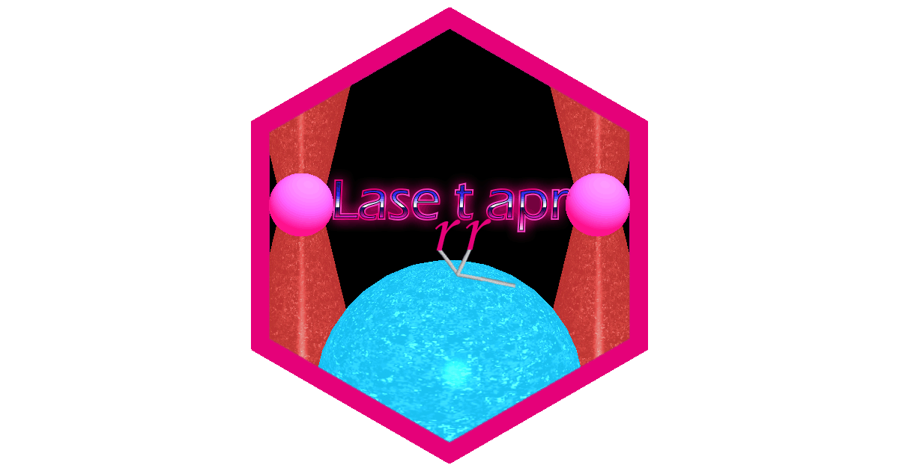

<!-- README.md is generated from README.Rmd. Please edit that file -->

# lasertrapr



<!-- badges: start -->

[](https://www.tidyverse.org/lifecycle/#experimental)
<!-- badges: end -->

The goal of lasertrapr is to automate the analysis of laser trap data.
The app is still being heavily developed, end-users should proceed with
caution. For more information and the official documentation refer to
the [website](https://lasertrapr.app).

Project future: The goal is to have the app published in the Journal of Open Source Software and rOpenSci. Updates and tests need to be added to prepare this for submission. Additionally, updates to support co-variance and two detector systems are being developed as well as an analyzer for isometric force clamping. 

Several peer-reviewed research articles have used either this app or prior versions of the codebase including: 

1) [FRET and optical trapping reveal mechanisms of actin activation of the power stroke and phosphate release in myosin V](https://www.jbc.org/article/S0021-9258(17)50627-4/fulltext)
2) [A mutation in switch I alters the load-dependent kinetics of myosin Va](https://www.nature.com/articles/s41467-023-38535-0)
3) [Myosin's powerstroke occurs prior to the release of phosphate from the active site](https://onlinelibrary.wiley.com/doi/epdf/10.1002/cm.21682)
4) [Positional Isomers of a Non-Nucleoside Substrate Differentially Affect Myosin Function](https://www.sciencedirect.com/science/article/pii/S0006349520305002)

## Installation

Current stable version will be hosted on my `drat` repo. 

``` r
# install.packages("drat")
drat::addRepo("brentscott93")
install.packages("lasertrapr")
```

You can install the development version of lasertrapr from GitHub with. 
``` r
# install.packages("devtools")
devtools::install_github("brentscott93/lasertrapr")
```
Note: This will install a random snapshot from my last commit. 

Disclaimer: This projected was started when I was in grad school at UMass Amherst in the Muscle Biophysics lab. I currently am at WashU in St. Louis in the Greenberg Lab, the developers of the MATLAB based SPASM program for analyzing lasertrap data. Development of lasertrapr is still on-going but at a slower pace than previously. If you want to use lastertrapr and could use a specific update, please open an issue explaining your need (or email me brents@wust.edu).
